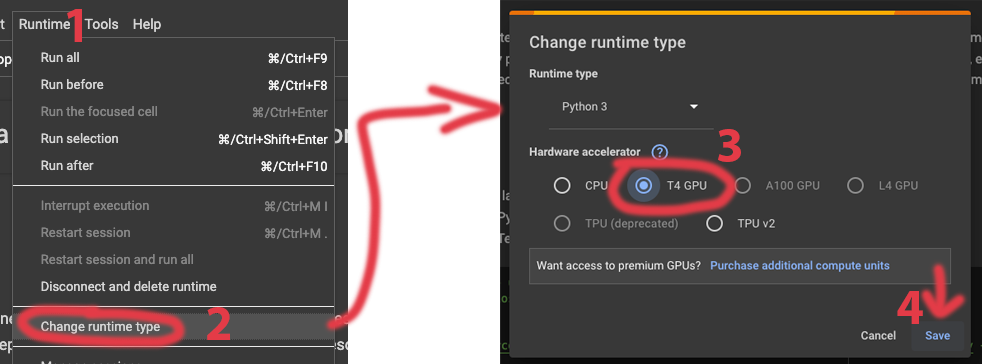

# AI for weather and climate Workshop

This repository contains the materials and notebooks for the **AI for weather and climate Workshop**, part of the **HIDSI workshop series**. 

The goal of this workshop is to provide hands-on experience with applying Artificial Intelligence (AI) and Machine Learning (ML) techniques to meteorological and climatological datasets. We cover some applications, from time series forecasting with local weather station data to global climate pattern prediction (ENSO) using deep learning.

The workshop is structured into three main parts:
1.  **AI methods with Weather Station data**: Basics of data handling, visualization, and forecasting using regression and neural networks.
2.  **AI for ENSO prediction**: Advanced deep learning architectures (CNNs) for spatiotemporal climate data.
3.  **Weather Foundational Model**: State-of-the-art techniques for emulating weather systems.

## Notebooks

**IMPORTANT**

If running on google colab, make sure to select the GPU runtime.



### Part 1: AI methods with Weather Station data

<a href="https://colab.research.google.com/github/griverat/ai_wx_clim/blob/main/Notebooks/Part1_Data_Exploration.ipynb" target="_blank"></a>
**Data Exploration**

<a href="https://colab.research.google.com/github/griverat/ai_wx_clim/blob/main/Notebooks/Part1_Weather_Forecasting.ipynb" target="_blank"></a>
**Weather Forecasting**

### Part 2: AI for ENSO prediction

<a href="https://colab.research.google.com/github/griverat/ai_wx_clim/blob/main/Notebooks/Part2_Data_Exploration.ipynb" target="_blank"></a>
**Data Exploration**

<a href="https://colab.research.google.com/github/griverat/ai_wx_clim/blob/main/Notebooks/Part2_ENSO_Prediction.ipynb" target="_blank"></a>
**ENSO Prediction**

### Part 3: Weather Foundational Model

<a href="https://colab.research.google.com/github/griverat/ai_wx_clim/blob/main/Notebooks/Part3_WFM.ipynb" target="_blank"></a>
**Weather Foundational Model with Prithvi WxC**

## Installation and Usage

You can run the notebooks in this repository either locally by setting up a Conda environment or by using Docker.

### Run Locally

To run the notebooks locally, you need to have [Conda](https://docs.conda.io/en/latest/) (or [Mamba](https://github.com/conda-forge/miniforge?tab=readme-ov-file#unix-like-platforms-macos-linux--wsl)) installed.

1.  **Clone the repository:**
    ```bash
    git clone https://github.com/griverat/ai_wx_clim.git
    cd ai_wx_clim
    ```

2.  **Create the Conda environment:**
    ```bash
    conda env create -f env.yml
    ```

3.  **Activate the environment:**
    ```bash
    conda activate hidsi_wxclim
    ```

4.  **Launch Jupyter Lab:**
    ```bash
    jupyter lab
    ```

### Run with Docker

If you prefer using Docker, ensure you have [Docker](https://www.docker.com/) and [Docker Compose](https://docs.docker.com/compose/) installed.

1.  **Clone the repository:**
    ```bash
    git clone https://github.com/griverat/ai_wx_clim.git
    cd ai_wx_clim
    ```

2.  **Run with Docker Compose:**
    ```bash
    docker compose up
    ```

3.  **Access Jupyter Lab:**
    Open your browser and navigate to [http://localhost:8888](http://localhost:8888).
    
    *Note: The default token is set to `hidsi`. If prompted, enter `hidsi` as the password/token.*


---
## Funding

This material is based upon work supported by the National Science Foundation Award No. 2149133, RII Track-1: Change Hawaii: Harnessing the Data Revolution for Island Resilience.
